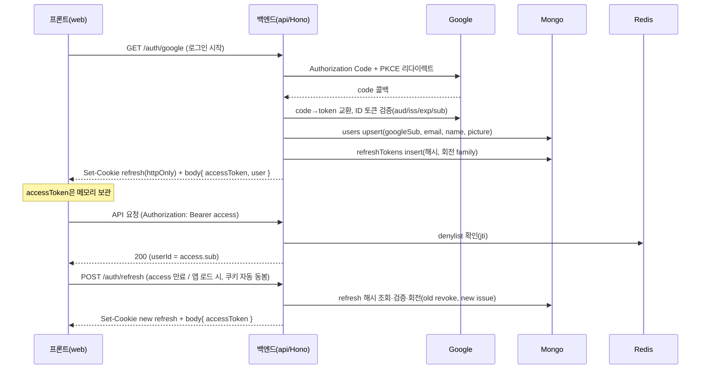

# 인증 (구글 OAuth 단독 + JWT)

> 관련: [데이터 모델](./data-model.md) · [파이프라인](./data-pipeline.md) · [인프라](./infrastructure.md) · [화면구조도](./frontend-screens.md)

## 대명제

- **로그인 창구는 구글 OAuth **하나뿐**.** 이메일/비번·다른 IdP 없음.
- 백엔드(Hono)가 구글 신원을 검증한 뒤 **자체 JWT 쌍(accessToken + refreshToken)**을 발급한다. 이후 모든 API는 이 JWT로 인증한다.
- **모든 사용자 데이터는 `userId`로 스코프**된다. `userId`는 **인증 토큰에서만** 나온다(요청 본문이 아니라). 이것이 기존 "단일유저 전제"를 대체한다 — 이제 구글 계정 = 사용자.

## 토큰 설계 (결정)

| 토큰 | 수명 | 저장 위치 | 용도 |
|---|---|---|---|
| **accessToken** (JWT) | 짧게 ~15분 | **클라이언트 메모리**(localStorage 금지 — XSS) | API 요청 `Authorization: Bearer`. 무상태 검증 |
| **refreshToken** (JWT, opaque-like) | 길게 ~30일 | **httpOnly + Secure + SameSite=Lax 쿠키** | access 재발급. **사용 시마다 회전(rotation)** |

- accessToken은 무상태(서버 조회 없이 서명 검증). 단 **즉시 무효화**가 필요할 때를 위해 Redis 거부목록(denylist) 병행(아래).
- refreshToken은 **Mongo에 해시로 저장**(`refreshTokens`)해 회전·취소·재사용 탐지. 쿠키라 JS가 못 읽어 탈취 표면 축소.
- 서명: HS256(단일 서비스라 대칭키 `JWT_SECRET`) 또는 RS256(키 분리 필요 시). 기본 HS256.

## 흐름



## 엔드포인트

| 메서드·경로 | 인증 | 설명 |
|---|---|---|
| `GET /auth/google` | — | OAuth 시작(Authorization Code + PKCE). state·nonce 발급 |
| `GET /auth/google/callback` | — | code 교환 + ID 토큰 검증 → users upsert → refresh 쿠키 set + access 반환 |
| `POST /auth/refresh` | refresh 쿠키 | refresh 회전 → 새 access(+새 refresh 쿠키). 재사용 탐지 시 family 전체 취소 |
| `POST /auth/logout` | access | refresh DB 취소 + 쿠키 삭제 + 현재 access를 Redis denylist에 등록(만료까지) |
| `GET /auth/me` | access | 현재 사용자(`users` 문서) 반환 |

## 인증 미들웨어 (모든 보호 라우트)

```
authMiddleware(c, next):
  token = bearer(c)                      # Authorization 헤더
  payload = verifyJWT(token, JWT_SECRET) # 만료·서명 검증, 실패 → 401
  if await redis.sismember('denylist', payload.jti): 401
  c.set('userId', payload.sub)           # 이후 모든 쿼리의 스코프
  await next()
```
- 모든 도메인 쿼리는 `{ userId: c.get('userId'), ... }`로 스코프([data-model §4 트랙 독립성](./data-model.md)).

## Redis 역할 (인프라 정합)

[인프라](./infrastructure.md)에서 미리 선언한 "세션 토큰 저장"이 여기서 실체화:
- **access denylist** — 로그아웃·강제 만료된 access의 `jti`를 만료시각까지 `SADD`/TTL. 무상태 access에 "즉시 취소" 추가.
- **레이트리밋** — `/auth/*`, 채점 LLM 호출 등 남용 방지.
- ⚠️ **refresh 원본은 Redis에 두지 않는다** — Redis flush = 전원 로그아웃. 취소·회전의 진실원천은 Mongo `refreshTokens`.

## 트랙 소유권 & import (인증된 API)

콘텐츠 추가는 이제 **프론트(앱)에서 시작**한다 — 사용자가 `soul-structuring` 스킬이 만든 **`.soul/{track}.zip`을 업로드**(트랙 추가 → ZIP 업로드). Mongo에 직접 쓰지 않고 **인증된 API를 거친다**:

| 메서드·경로 | 인증 | 본문 | 동작 |
|---|---|---|---|
| `POST /tracks/import` | access(JWT) | **multipart zip / raw zip / JSON**(manifest + decks) | zip이면 서버가 압축 해제(`unzip.ts`) → **JWT에서 userId 도출** → 트랙/덱/개념/카드 upsert + `cardStates` 초기화, 전부 그 userId로 스코프. orphan soft-delete([파이프라인 §3](./data-pipeline.md)) |
| `PATCH /tracks/:id` | access(JWT) | `{ title?, examDate? }` | 이름·시험일 부분 수정(#3·#14). 소유자 스코프, 아니면 404 |
| `DELETE /tracks/:id` | access(JWT) | — | 소유권 확인 후 자식 cascade 영구 삭제(위험 구역). 아니면 404 |

- **CLI도 유효:** zip은 평범한 아카이브라, CLI/스크립트로 같은 zip을 같은 엔드포인트에 올려도 동일 동작(얇은 클라이언트). 앱 업로드가 기본일 뿐. JSON 직접 본문도 하위호환 유지.
- 결과: "단일유저 전제" 제거 → 한 인스턴스가 여러 구글 계정을 독립 지원. 트랙은 인증한 사용자에게 귀속. zip엔 유저 정보가 없고 소유권은 **JWT가 부여**한다.

## 프론트(web) 처리

- **로그인 화면(#0)**: "Google로 계속하기" → `/auth/google`로 이동(리다이렉트). 콜백 후 홈.
- **트랙 추가(#13)·시험일 설정(#14)**: 홈 `＋ 추가` 또는 빈 상태 CTA → zip 업로드 → 완료 → 시험일 설정 → 대시보드. 업로드는 access(JWT) 동봉 `POST /tracks/import`(multipart), examDate는 업로드 후 `PATCH /tracks/:id`. (백엔드 구현됨 · **프론트 실호출 배선은 남음** — 현재 화면 목업)
- accessToken은 **메모리(상태)에 보관**, 모든 요청에 `Authorization: Bearer`. localStorage 금지.
- **앱 로드/401 시** `/auth/refresh`(쿠키 자동 동봉)로 access 침묵 재발급 → 실패하면 로그인 화면.
- **로그아웃**(설정 #11) → `/auth/logout` → 메모리 토큰 폐기 → 로그인 화면.
- 미인증 상태로 보호 화면 접근 시 로그인으로 가드.

## 구글 클라우드 콘솔 설정 (실제 연동 — 사용자 1회 수행)

코드는 완성돼 있고, 실제 로그인을 켜려면 **본인의 구글 OAuth 클라이언트**가 필요하다(이 부분만 사람이 직접). [console.cloud.google.com](https://console.cloud.google.com):

1. **프로젝트 생성/선택** (예: `study-anything`).
2. **OAuth 동의 화면** → User Type `External` → 앱 이름·지원 이메일 입력 → **Scopes는 `openid` `email` `profile`만** → **Test users에 본인 구글 이메일 추가**(미검증 앱은 테스트 사용자 외 로그인 차단).
3. **사용자 인증 정보 → OAuth 클라이언트 ID 만들기** → 유형 **웹 애플리케이션**.
   - **승인된 리디렉션 URI**에 코드 기본값과 **정확히 일치**하게 입력: `http://localhost:8787/auth/google/callback` (끝 슬래시·포트·경로 한 글자도 다르면 `redirect_uri_mismatch`).
4. 발급된 **클라이언트 ID/시크릿**을 `.env`에 채운다(아래 표). **시크릿은 `.env`에만, 절대 커밋 금지.**

검증(라이브): `.env` 채운 뒤 `docker compose up` 또는 `pnpm api`+`pnpm web` → 프론트에서 "Google로 계속하기" → 본인 계정 로그인 → 홈 복귀 → `/auth/me`가 프로필 반환이면 연동 완료. 자동화(Playwright 등)는 구글이 봇 로그인을 차단하므로 **수동 클릭으로 1회 확인**한다.

> 코드 경계까지(콜백→세션→refresh 회전→재사용 탐지)는 Google만 모킹한 E2E 테스트(`auth/flow.test.ts`)로 이미 검증됨. 위 단계는 그 경계 너머의 실제 구글 토큰 교환만 켜는 작업.

## dev 전용 게이트웨이 (자동화 E2E)

구글은 봇 로그인을 차단하므로, 자동화 테스트는 **구글을 우회하는 dev 전용 엔드포인트**로 인증한다.

| 메서드·경로 | 가용 조건 | 동작 |
|---|---|---|
| `POST /auth/dev/login` | **`NODE_ENV !== production`일 때만 라우트 등록** | 고정 **테스트 계정**(`dev@study-anything.test`, googleSub `dev-test-account`) upsert → 정상 세션(access + refresh 쿠키) 발급. 응답에 `accessToken` + `user` |

- **운영에선 라우트 자체가 존재하지 않는다**(`config.isProd` 분기로 미등록 → 404). 토큰 발급 경로는 평소와 동일(`issueSession`)이라 별도 우회 경로가 생기지 않음.
- 프론트: `VITE_DEV_LOGIN`이 설정된 빌드에서만 로그인 화면에 "dev 로그인" 버튼 노출(`auth.ts devLogin()` → 응답의 access를 메모리 보관). 운영 빌드엔 플래그 미설정.
- 용도: 로컬 풀스택(api+web+Mongo+Redis)에서 **업로드→examDate→삭제 루프를 Playwright로 자동 검증**. 라이브로 통과 확인됨.

## 환경변수 (`.env`, 서버 전용)

| 변수 | 용도 |
|---|---|
| `GOOGLE_CLIENT_ID` / `GOOGLE_CLIENT_SECRET` | 구글 OAuth 클라이언트 |
| `GOOGLE_REDIRECT_URI` | 콜백 URL(예: `http://localhost:8787/auth/google/callback`) |
| `JWT_SECRET` | access/refresh 서명(HS256) |
| `ACCESS_TTL` / `REFRESH_TTL` | 토큰 수명(기본 15m / 30d) |
| `WEB_ORIGIN` | CORS·쿠키 도메인(프론트 origin) |

> 모든 시크릿은 `.env`(gitignore)에만. 프론트로 노출 금지. 노출된 키는 폐기·재발급.

## 보안 체크리스트

- accessToken 메모리만(localStorage·sessionStorage 금지) · refresh는 httpOnly 쿠키.
- refresh **회전 + 재사용 탐지**(탈취 시 family 취소).
- CSRF: refresh 쿠키 `SameSite=Lax` + `/auth/refresh`는 쿠키만으로 동작(상태변경 POST엔 별도 CSRF 토큰 또는 SameSite 의존).
- OAuth `state`(CSRF)·`nonce`(replay) 검증, ID 토큰 `aud/iss/exp` 확인.
- CORS는 `WEB_ORIGIN`만 허용 + `credentials: true`.
- **인덱스 강제(부팅 시 `ensureIndexes`)**: `users.googleSub` unique(중복 사용자 race 차단), `refreshTokens.tokenHash` unique, `refreshTokens.expiresAt` TTL(만료·폐기 토큰 자동 정리).
