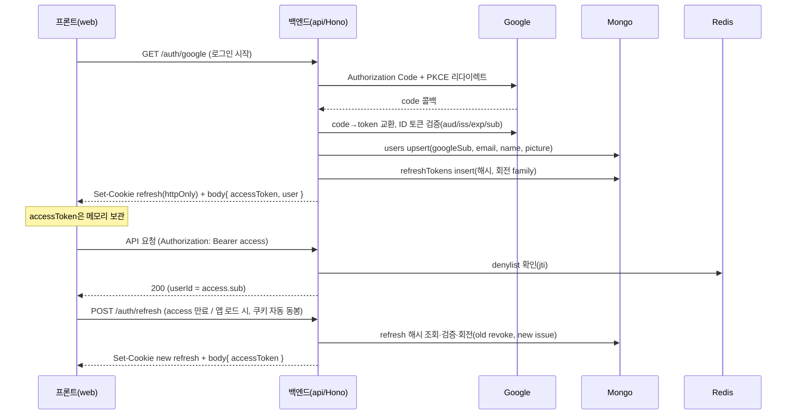

# 인증 (구글 OAuth 단독 + JWT)

> 관련: [데이터 모델](./data-model.md) · [파이프라인](./data-pipeline.md) · [인프라](./infrastructure.md) · [화면구조도](./frontend-screens.md)

## 대명제

- **로그인 창구는 구글 OAuth **하나뿐**.** 이메일/비번·다른 IdP 없음.
- 백엔드(Hono)가 구글 신원을 검증한 뒤 **자체 JWT 쌍(accessToken + refreshToken)**을 발급한다. 이후 모든 API는 이 JWT로 인증한다.
- **모든 사용자 데이터는 `userId`로 스코프**된다. `userId`는 **인증 토큰에서만** 나온다(요청 본문이 아니라). 이것이 기존 "단일유저 전제"를 대체한다 — 이제 구글 계정 = 사용자.

## 토큰 설계 (결정)

| 토큰 | 수명 | 저장 위치 | 용도 |
|---|---|---|---|
| **accessToken** (JWT) | 짧게 ~15분 | **클라이언트 메모리**(localStorage 금지 — XSS) | API 요청 `Authorization: Bearer`. 무상태 검증 |
| **refreshToken** (JWT, opaque-like) | 길게 ~30일 | **httpOnly + Secure + SameSite=Lax 쿠키** | access 재발급. **사용 시마다 회전(rotation)** |

- accessToken은 무상태(서버 조회 없이 서명 검증). 단 **즉시 무효화**가 필요할 때를 위해 Redis 거부목록(denylist) 병행(아래).
- refreshToken은 **Mongo에 해시로 저장**(`refreshTokens`)해 회전·취소·재사용 탐지. 쿠키라 JS가 못 읽어 탈취 표면 축소.
- 서명: HS256(단일 서비스라 대칭키 `JWT_SECRET`) 또는 RS256(키 분리 필요 시). 기본 HS256.

## 흐름



## 엔드포인트

| 메서드·경로 | 인증 | 설명 |
|---|---|---|
| `GET /auth/google` | — | OAuth 시작(Authorization Code + PKCE). state·nonce 발급 |
| `GET /auth/google/callback` | — | code 교환 + ID 토큰 검증 → users upsert → refresh 쿠키 set + access 반환 |
| `POST /auth/refresh` | refresh 쿠키 | refresh 회전 → 새 access(+새 refresh 쿠키). 재사용 탐지 시 family 전체 취소 |
| `POST /auth/logout` | access | refresh DB 취소 + 쿠키 삭제 + 현재 access를 Redis denylist에 등록(만료까지) |
| `GET /auth/me` | access | 현재 사용자(`users` 문서) 반환 |

## 인증 미들웨어 (모든 보호 라우트)

```
authMiddleware(c, next):
  token = bearer(c)                      # Authorization 헤더
  payload = verifyJWT(token, JWT_SECRET) # 만료·서명 검증, 실패 → 401
  if await redis.sismember('denylist', payload.jti): 401
  c.set('userId', payload.sub)           # 이후 모든 쿼리의 스코프
  await next()
```
- 모든 도메인 쿼리는 `{ userId: c.get('userId'), ... }`로 스코프([data-model §4 트랙 독립성](./data-model.md)).

## Redis 역할 (인프라 정합)

[인프라](./infrastructure.md)에서 미리 선언한 "세션 토큰 저장"이 여기서 실체화:
- **access denylist** — 로그아웃·강제 만료된 access의 `jti`를 만료시각까지 `SADD`/TTL. 무상태 access에 "즉시 취소" 추가.
- **레이트리밋** — `/auth/*`, 채점 LLM 호출 등 남용 방지.
- ⚠️ **refresh 원본은 Redis에 두지 않는다** — Redis flush = 전원 로그아웃. 취소·회전의 진실원천은 Mongo `refreshTokens`.

## 트랙 소유권 & import (인증된 API)

콘텐츠 추가는 여전히 프론트가 아니라 CLI에서 출발하지만, **Mongo에 직접 쓰지 않고 인증된 API를 거친다**:

| 메서드·경로 | 인증 | 본문 | 동작 |
|---|---|---|---|
| `POST /tracks/import` | access(JWT) | JSON = soul 번들(manifest + decks) | **JWT에서 userId 도출** → 트랙/덱/개념/카드 upsert + `cardStates` 초기화, 전부 그 userId로 스코프. orphan soft-delete([파이프라인 §3](./data-pipeline.md)) |

- CLI(import 스크립트)는 `.soul/{track}`을 읽어 이 엔드포인트에 **사용자 토큰과 함께 POST**하는 얇은 클라이언트가 된다. 결정적 upsert 로직은 그대로, 소유권만 JWT에서 나온다.
- 결과: "단일유저 전제" 제거 → 한 인스턴스가 여러 구글 계정을 독립 지원. 트랙은 인증한 사용자에게 귀속.

## 프론트(web) 처리

- **로그인 화면(#0)**: "Google로 계속하기" → `/auth/google`로 이동(리다이렉트). 콜백 후 홈.
- accessToken은 **메모리(상태)에 보관**, 모든 요청에 `Authorization: Bearer`. localStorage 금지.
- **앱 로드/401 시** `/auth/refresh`(쿠키 자동 동봉)로 access 침묵 재발급 → 실패하면 로그인 화면.
- **로그아웃**(설정 #11) → `/auth/logout` → 메모리 토큰 폐기 → 로그인 화면.
- 미인증 상태로 보호 화면 접근 시 로그인으로 가드.

## 환경변수 (`.env`, 서버 전용)

| 변수 | 용도 |
|---|---|
| `GOOGLE_CLIENT_ID` / `GOOGLE_CLIENT_SECRET` | 구글 OAuth 클라이언트 |
| `GOOGLE_REDIRECT_URI` | 콜백 URL(예: `http://localhost:8787/auth/google/callback`) |
| `JWT_SECRET` | access/refresh 서명(HS256) |
| `ACCESS_TTL` / `REFRESH_TTL` | 토큰 수명(기본 15m / 30d) |
| `WEB_ORIGIN` | CORS·쿠키 도메인(프론트 origin) |

> 모든 시크릿은 `.env`(gitignore)에만. 프론트로 노출 금지. 노출된 키는 폐기·재발급.

## 보안 체크리스트

- accessToken 메모리만(localStorage·sessionStorage 금지) · refresh는 httpOnly 쿠키.
- refresh **회전 + 재사용 탐지**(탈취 시 family 취소).
- CSRF: refresh 쿠키 `SameSite=Lax` + `/auth/refresh`는 쿠키만으로 동작(상태변경 POST엔 별도 CSRF 토큰 또는 SameSite 의존).
- OAuth `state`(CSRF)·`nonce`(replay) 검증, ID 토큰 `aud/iss/exp` 확인.
- CORS는 `WEB_ORIGIN`만 허용 + `credentials: true`.
