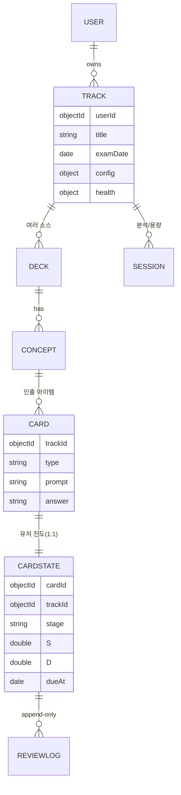

# 데이터 모델 & 알고리즘 운용 (MongoDB)

> 스택: **MongoDB + Hono(serverless) + React/Tailwind(vitest)**.
> 이 문서는 **raw md → 가공 후 "상용 가능한 결과 스키마"**(가공 과정은 다루지 않음)와, **그 데이터 위에서 [ASR 알고리즘](./learning-algorithm-detail.md)이 어떻게 운용되는지**를 정의한다.

## 0. 핵심 설계 결정 (확정)

1. **콘텐츠는 유저 전용**, 단 **콘텐츠(불변)와 학습 진도(가변)는 컬렉션 분리.**
   - 콘텐츠 = `decks/concepts/cards` (거의 안 바뀜).
   - 진도 = `cardStates`(매 인출마다 변함) + `reviewLogs`(append-only).
   - 이유: 변경 빈도가 다르고, 추후 "덱 공유"로 확장 시 진도만 유저별로 두면 됨.
2. **트랙(학습 그룹) = 독립 학습 단위.** 한 유저가 토익/오픽/물리 트랙을 동시에 가지며 **서로 절대 안 섞임**(모든 스케줄러 쿼리가 `{userId, trackId}`로 스코프).
3. **트랙 = 여러 소스(deck) 묶음.** 시험일·목표·용량·건강상태는 **트랙 단위**.
4. **플랜은 저장하지 않는다.** 영속 상태는 `cardStates(S/D/단계/dueAt) + track(examDate/config)`뿐. 매 요청 시 현재 상태에서 그날 플랜을 재계산 → serverless(무상태)와 정확히 맞음.

### 0.1 저장 vs 파생 — "미리 만드나, 요청 시 만드나"

트랙의 **status·진도·오늘 낼 카드**는 **미리 만들어 두지 않고 요청이 올 때 그때 계산**한다(on-demand). 저장하는 건 카드 하나하나의 원자 상태뿐이고, 나머지는 전부 그 상태에서 파생한다.

| 구분 | 항목 | 갱신 시점 |
|---|---|---|
| **저장(진실원천)** | `cardStates`(S·D·dueAt·stage·reps·lapses·lastReviewedAt·triaged·archived…) · `reviewLogs`(append-only) · `sessions` · `tracks`(examDate·dailyCapacity) | **인출 처리 시에만** 기록/갱신 |
| **파생(요청 시 계산, 저장 안 함)** | 오늘 낼 카드 목록 · 진도 % · 건강상태(과부하/숙달/AHEAD) · 시험당일 예측 `R(examDate)` · 우선순위 · 트리아지 대상 | **읽을 때마다** `{userId,trackId}` 상태에서 순수 계산 |

**왜 on-demand인가:**
1. **미루기/몰아하기 흡수** — 미리 구운 "오늘 플랜"은 유저가 미루거나 더 하는 순간 거짓이 됨. 매 요청 재계산이라야 항상 현실 반영(§6).
2. **시간 의존성** — `R(t)`는 시간에 연속 감쇠. "지금 due/긴급도"는 `now` 기준이라 요청 시점 계산이 자연히 정확.
3. **serverless 정합** — 무상태 함수. 자정마다 전 유저 플랜을 굽는 크론/백그라운드 잡 불필요.
4. **무효화 지옥 없음** — examDate 변경·미루기·재가공(orphan archive) 때마다 캐시를 갈아엎을 필요 없음. 다음 요청이 자동 최신.

**예외 — 값싼 증분 캐시(플랜을 굽는 게 아님):** 규모가 커지면 진도/완료 누계는 매번 전체 스캔 대신 **인출 처리 시 증분 갱신**할 수 있고, `cardStates.priority`는 이미 **"마지막 계산값(선택 캐시·비권위)"**로 둔다. 기본은 순수 on-demand로 시작하고, 느려질 때만 집계 캐시를 더한다.

**저장도 파생도 아닌 것 — 자가설명(휘발성):** 개념 모드의 자가설명은 **저장하지 않는다.** 런타임 LLM이 이해 충분 여부만 판정해 통과시키는 [이해도 게이트](./runtime-grading.md#개념-이해도-게이트-자가설명-확인)의 입력일 뿐(인코딩 단계 → S 무관). 따라서 `conceptStates` 같은 컬렉션을 만들지 않는다.

---

## 1. 컬렉션 지도 (ERD)



`userId/trackId`는 거의 모든 컬렉션에 **비정규화로 박아** 단일 쿼리·인덱스로 트랙 독립성을 보장한다(서버리스 라운드트립 최소화).

---

## 2. 콘텐츠 스키마 — "raw md의 가공 결과" (상용 가능한 형태)

### 2.1 `tracks` — 학습 그룹 (독립 단위)
```jsonc
{
  "_id": "ObjectId",
  "userId": "ObjectId",
  "title": "토익",
  "subjectType": "language",          // 출제·튜닝 힌트(optional)
  "examDate": "2026-07-15T00:00:00Z", // ★ 핵심 입력 ②
  "status": "active",                 // active | archived | done
  "config": {
    "baseTargetRetention": 0.90,      // 평소 목표 보유율
    "examTargetRetention": 0.95,      // 시험 임박 상향값
    "nMin": 3,                        // 졸업 최소 '서로 다른 날' 성공 수
    "dailyCapacity": { "mode": "minutes", "value": 20 } // 평소 용량
  },
  "health": {                         // 캐시(대시보드용). 진실 원천은 cardStates 집계
    "state": "on_track",              // on_track | behind_overload | behind_mastery | ahead
    "backlog": 0,
    "newIntroDeadline": "2026-07-09T00:00:00Z", // examDate - nMin*minSpacing
    "feasible": true,
    "triagedCount": 0,
    "updatedAt": "2026-06-10T09:00:00Z"
  },
  "createdAt": "…", "updatedAt": "…"
}
```

### 2.2 `decks` — 소스/챕터 (트랙 안에 여러 개)
```jsonc
{
  "_id": "ObjectId",
  "trackId": "ObjectId", "userId": "ObjectId",
  "title": "Part 5 · 문법",
  "sourceRef": ".raw/toeic_part5.md",  // 원본 md 참조(원본은 DB 밖/gitignore)
  "order": 1,
  "createdAt": "…"
}
```

### 2.3 `concepts` — 개념(=「개념」모드 콘텐츠)
```jsonc
{
  "_id": "ObjectId",
  "soulKey": "present-perfect-vs-past",  // ② 산출 안정키(idempotent import)
  "trackId": "ObjectId", "deckId": "ObjectId", "userId": "ObjectId",
  "title": "현재완료 vs 과거시제",
  "bodyMd": "## 핵심\n현재완료는 …",          // 개념 본문(인코딩 단계 표시)
  "elaboration": "왜? 과거의 한 시점 vs 현재 영향…", // 자기설명 모범/유도
  "order": 3,
  "confusableWith": ["conceptId_x", "conceptId_y"], // 교차·변별 출제용(혼동쌍). import가 soulKey→ObjectId 해소
  "createdAt": "…"
}
```

### 2.4 `cards` — 다지기 인출 아이템 (콘텐츠/불변, 개념당 N개)
```jsonc
{
  "_id": "ObjectId",
  "soulKey": "pp-since-2010",      // ② 산출 안정키(idempotent import·재가공 추적)
  "conceptId": "ObjectId", "trackId": "ObjectId",
  "deckId": "ObjectId", "userId": "ObjectId",
  "type": "cloze",                 // cloze | qa | mcq | application
  "prompt": "He ___ (live) here since 2010.",
  "answer": "has lived",
  "distractors": ["lived", "is living", "lives"], // mcq용(없으면 빈 배열)
  "hint": "since + 완료",
  "explanation": "since + 기간 → 현재완료. 과거형은 현재와 단절.", // 필수: 채점 후 표시 + LLM 판정 근거(런타임 생성 금지)
  "grading": {                     // 선택 — 런타임 라우팅은 card.type이 결정(mcq=동등비교, 그 외=LLM)
    "rubric": [],                  // 선택: 개방형 LLM 채점의 판정 체크포인트(일관성↑)
    "acceptedAnswers": ["has lived", "has lived here"], // 선택: LLM 장애 시 결정적 폴백
    "normalize": ["lowercase", "trim", "collapse-space"],
    "keywords": []                 // 선택: LLM 장애 시 키워드 폴백
    // (후방호환) 기존 번들의 "mode" 필드는 무시됨 — 런타임을 라우팅하지 않음
  },
  "difficultyPrior": 0.3,          // 초기 난이도 추정(0~1) → cardState.D 시드
  "soulHash": "sha1:…",            // 재가공 변경 감지(진도 마이그레이션 판단)
  "status": "active",              // active | archived(재가공 시 사라진 카드 → soft-delete)
  "createdAt": "…"
}
```

> **요약:** Claude 스킬이 raw md를 가공해 산출해야 하는 "상용 형태" = `track 1 → deck N → concept N → card N(type별)`. 단순 요약이 아니라 **인출 가능한 atomic 카드 + 혼동쌍 태그 + 참조정답(`answer`)·해설(`explanation`)**이 핵심. 런타임 채점은 `card.type`이 결정한다 — **`mcq`는 동등비교, 그 외는 경량 LLM이 `{score, reason}` 채점**([런타임 채점](./runtime-grading.md) · [파이프라인](./data-pipeline.md) §6). `grading` 객체는 선택적 폴백일 뿐이다.

---

## 3. 학습 진도 스키마 (가변 — 스케줄러의 심장)

### 3.1 `cardStates` — 카드 × 유저 학습 상태 (card와 1:1)
```jsonc
{
  "_id": "ObjectId",
  "cardId": "ObjectId",
  "trackId": "ObjectId", "userId": "ObjectId", // 비정규화(쿼리 스코프)
  "stage": "consolidating",   // 영속: new|acquiring|consolidating|maintaining  (pretest·encoding은 첫 세션 내 과도상태, 영속 안 함)
  "S": 2.31,                  // 안정도(일) — 간격의 원천
  "D": 0.42,                  // 난이도(0~1)
  "reps": 4, "lapses": 1,
  "lastReviewedAt": "2026-06-08T10:00:00Z",
  "dueAt": "2026-06-10T10:00:00Z",  // ★ 스케줄러가 쿼리하는 핵심 필드(=R이 target까지 떨어지는 시점)
  "lastGrade": "good",
  "successDays": ["2026-06-06", "2026-06-08"], // 서로 다른 날 성공(졸업 판정)
  "sessionCorrectStreak": 1,  // 세션 내 정답 연속(성공적 재학습 졸업)
  "priority": 0.0,            // 마지막 계산값(선택 캐시)
  "triaged": false,           // 분량초과 트리아지로 범위 제외 표시
  "archived": false,          // 원본 카드가 재가공에서 사라짐(orphan soft-delete) → 스케줄러 제외
  "selfOnlySuccess": true     // 성공이 '자가채점 폴백'뿐(LLM/mcq 동등비교 성공 없음) → 졸업 승급 보류(아래 ⑦)
}
```
- 콘텐츠 생성 시 **모든 카드에 대해 `stage:"new", S:0, dueAt: now`로 cardState를 함께 생성** → "신규 카드 = dueAt이 지금"으로 통일되어 쿼리가 단순해짐.
- **R(인출확률)은 저장 안 함.** 필요 시 `S, lastReviewedAt`으로 즉석 계산: `R = (1 + (now-last)/(c·S))^-1`. 단, **due 판정은 R 재계산 없이 `dueAt` 비교만** (dueAt이 이미 "R=target 시점"을 인코딩).

### 3.2 `reviewLogs` — 인출 기록 (append-only)
```jsonc
{
  "_id": "ObjectId",
  "cardId": "ObjectId", "trackId": "ObjectId", "userId": "ObjectId",
  "ts": "2026-06-08T10:00:00Z",
  "grade": "good",            // again|hard|good|easy
  "elapsedMs": 4200,
  "wasPretest": false,
  "rAtReview": 0.88,          // 복습 시점 예측 R(=desirable difficulty 측정, FSRS 최적화용)
  "sBefore": 1.4, "sAfter": 2.31, "dBefore": 0.45, "dAfter": 0.42
}
```
용도: ① 건강 판정(최근 lapse율), ② 파라미터 적합(FSRS식 S/D 모델 튜닝), ③ 분석/대시보드.

### 3.3 `sessions` — 세션 기록 (선택, 용량·평탄화·분석)
```jsonc
{
  "_id":"ObjectId", "trackId":"ObjectId", "userId":"ObjectId",
  "startedAt":"…", "endedAt":"…",
  "plannedLoad": 24, "completed": 24,
  "healthState": "on_track",
  "newIntroduced": 8, "reviewsDone": 16
}
```

---

## 4. 인덱스 & 트랙 독립성

```
tracks:      { userId: 1, status: 1 }
decks:       { trackId: 1, order: 1 }
concepts:    { trackId: 1, deckId: 1, order: 1 }
cards:       { conceptId: 1 }, { trackId: 1 }
cardStates:  { userId: 1, trackId: 1, dueAt: 1 }      // ★ 스케줄러 주 쿼리
             { userId: 1, trackId: 1, stage: 1 }
             { userId: 1, trackId: 1, triaged: 1 }
reviewLogs:  { trackId: 1, ts: -1 }, { cardId: 1, ts: -1 }
```

**독립성 보장:** 모든 스케줄링·집계 쿼리는 `{ userId, trackId }`로 시작. 토익 세션은 `trackId=토익`만 건드리므로 오픽/물리 cardStates를 절대 만지지 않음. 트랙별로 `examDate / config / health`가 따로라 강도·일정도 완전 분리.

---

## 5. 알고리즘이 데이터를 운용하는 방식 (§5.5 컨트롤러 ↔ 쿼리)

특정 트랙의 "오늘 세션 생성" API(Hono 핸들러, 무상태) 흐름:

| 단계 | 한 일 | 데이터 연산 |
|---|---|---|
| **① 지평** | Δ 계산 | `track.examDate − now` |
| **② 작업 풀** | 연체+오늘due 복습 | `cardStates.find({userId,trackId, dueAt≤now, stage≠"new", triaged:false, archived:false})` — **stage 화이트리스트 금지**(아래 주의) |
| | 신규(도입 마감 전이면) | `cardStates.find({userId,trackId, stage:"new"}).limit(intakeQuota)` — `now < track.health.newIntroDeadline`일 때만 |

> **⚠️ due 선별은 오직 `dueAt`로.** `stage∈{...}` 같은 화이트리스트를 추가하면 `mastered`(유지 복귀용)·`pretest`/`encoding`(중단된 첫 세션) 카드가 두 쿼리 어디에도 안 잡혀 **영구 누락**된다. 규칙:
> - `mastered`는 별도 단계가 아니라 **dueAt이 길게 잡힌 유지 상태**로 취급 → due 되면 그대로 ② 쿼리에 재유입(= "유지 중 틀리면 복귀"). `maintaining`과 의미가 같으므로 **enum에서 `mastered`를 빼고 `maintaining`으로 통일**(졸업 시 `stage:"maintaining"` + dueAt 길게).
> - `pretest`/`encoding`은 **영속 안 되는 과도 상태**(첫 세션 메모리 내에서만). 중단 시 cardState는 `stage:"new"` 또는 `acquiring`으로만 남는다.
| **③ 우선순위** | 위험도×시험중요도 | 함수 계산: 위험도=`f(R(now)=g(S,lastReviewedAt), 연체일)`, 중요도=`f(nMin−|successDays|, Δ)` |
| **④ 용량** | 오늘 처리량 한도 | `track.config.dailyCapacity` (+ 유저의 오늘 override) |
| **⑤ 건강 판정** | 상태기계 | `backlog=count(dueAt<오늘0시)`; `lapseRate=reviewLogs(최근)`; **단위 통일 후** `feasible = 필요_분 ≤ 용량_분 × 남은일수` → `track.health.state` 갱신 |
| **⑥ 인출 처리** | 채점→상태 갱신(트랜잭션) | `reviewLogs.insertOne(...)` + `cardStates.updateOne({_id}, { S,D,reps,lapses,lastReviewedAt, stage, successDays, dueAt: now + capToExam(intervalForTarget(S, target)) })` |
| **⑦ 졸업** | 숙달 전이 | `|successDays|≥nMin`(짧은 시험이면 완화) **and** `R(examDate)≥target` **and** `selfOnlySuccess=false`(LLM 또는 mcq 동등비교 성공 1회 이상) → `stage:"maintaining"` + `dueAt` 길게. due 되면 ②로 자동 복귀. 자가채점 폴백 성공뿐이면 보수적 S 증가 |
| **⑧ 트리아지** | 분량초과 | 우선순위 낮은 cardStates `triaged:true` + 사용자 고지 리스트 반환 |

핵심 도출 함수(콘텐츠 아닌 순수 계산, 서버 코드에 위치):
- `R(now)= (1 + (now−lastReviewedAt)/(c·S))^-1`
- `intervalForTarget(S, target) = c·S·(1/target − 1)` → **다음 dueAt**
- `capToExam(I) = min(I, fit_to_remaining_days)` ([상세 §5](./learning-algorithm-detail.md))
- `target = (Δ ≤ 7) ? config.examTargetRetention : config.baseTargetRetention`
- **단위 환산(⑤ 실현가능성):** `secPerRetrieval = median(reviewLogs.elapsedMs)/1000` (데이터 없으면 트랙 기본 ~10s). `필요_분 = (미숙달 카드수 × 남은필요세션) × secPerRetrieval / 60`. capacity가 `cards` 모드면 `용량_분 = value × secPerRetrieval / 60`. → 양변 모두 **분(minutes)**으로 비교(개수 ↔ 분 혼동 금지).

> **주의 1 — 사전테스트는 S를 건드리지 않는다.** `wasPretest:true` 인출(배우기 전 추측, 보통 오답)은 `reviewLogs`에 **기록만** 하고 ⑥의 `update_stability`에서 **제외**한다. 그렇지 않으면 인코딩 전에 S가 추락해 errorful-generation이 시드하려던 상태를 망친다.

> **주의 2 — `behind_overload`와 `behind_mastery`는 동시 발생 가능**(넘치면서 동시에 자꾸 틀림). `health.state`는 단일 enum이므로 **우선순위 = 과부하 우선**: 둘 다면 `behind_overload`로 판정(부하부터 덜고 → target 유지/하향). 강도 노브가 임의 승자에 좌우되지 않도록 고정.

> 강조: **due 선별은 `dueAt` 인덱스 쿼리 한 방.** R은 due "선별"이 아니라 due된 것들 사이의 "우선순위"에만 즉석 계산. 그래서 서버리스에서도 트랙당 인덱스 쿼리 1~2회로 끝남.

---

## 6. 미룸·몰아치기·분량초과가 데이터로 흡수되는 방식

- **미룸:** 며칠 안 들어옴 → 해당 cardStates의 `dueAt`이 과거로 누적될 뿐. 다음 세션 ② 쿼리(`dueAt≤now`)에 **자동 유입**. 별도 "밀린 플랜 복구" 데이터 없음 → 설계 결정 4의 효과.
- **몰아치기:** 유저가 더 요청 → `stage:"new"`를 추가 소비(앞당김), 미래 복습은 `intervalForTarget`로 본 **기대 S증가** 순. 그날 `sessions.completed`만 커짐, 내일 용량은 `sessions` 평탄화 로직이 하향.
- **분량초과(트리아지):** ⑤에서 `feasible:false` → ⑧이 `triaged:true` 마킹 + 응답에 "제외 범위" 명시. `track.health.triagedCount`로 대시보드 노출.

---

## 7. 열린 항목(다음 결정 대상)

- 인증/유저 모델(`users`) 상세 — auth 방식 정해지면 확정.
- `decks` 레이어를 MVP에서 생략하고 `concept.deckId`만 nullable로 둘지(소스가 1개뿐인 트랙).
- FSRS 파라미터(c, S/D 갱신식 계수)를 전역 고정 vs 유저별 적합 — 초기엔 전역 고정, `reviewLogs` 쌓이면 적합.
- 콘텐츠 버전/재가공 시 기존 `cardStates` 마이그레이션 정책(카드 prompt 수정 시 진도 유지 여부).
