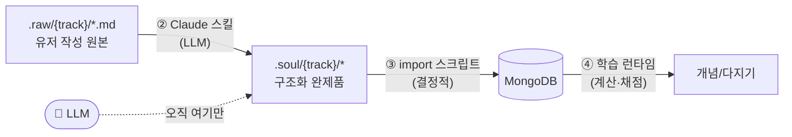

# 데이터 파이프라인: raw → soul → db → 학습

> 관련: [데이터 모델](./data-model.md) · [알고리즘 상세](./learning-algorithm-detail.md) · [개요](./learning-algorithm-overview.md)

## 대원칙 — LLM은 **2단계에서만**

```
.raw/{track}  ──[① 유저 유지]
      │
      ▼  ② .claude 스킬 (LLM 유일 지점)
.soul/{track}/* (완제품 구조화 데이터)
      │
      ▼  ③ import 스크립트 (순수 결정적, LLM 없음)
   MongoDB
      │
      ▼  ④ 학습 런타임 (순수 계산 + 자동/자가 채점, LLM 없음)
```

→ **런타임(③④)은 LLM을 절대 호출하지 않는다.** 따라서 **②가 "런타임에 필요한 모든 것"을 완제품으로 산출**해야 한다. 이 문서의 부합성 체크(§6)는 "런타임이 요구하는 모든 데이터가 ②에서 베이크되는가"를 검증한다.



---

## 1단계 — `.raw/{trackName}/` (유저가 직접 유지)

- 자유 형식 md. 여러 소스 가능 → 한 트랙에 여러 파일.
  ```
  .raw/토익/part5_문법.md
  .raw/토익/vocab_band7.md
  .raw/물리/역학.md
  ```
- `.gitignore`에 `.raw/*` 이미 등록(원본은 커밋 안 함, 유저 로컬 유지).
- 트랙 식별 = **디렉토리명 `{trackName}`**.

---

## 2단계 — `.claude` 스킬로 `.soul/{trackName}/` 가공 (LLM 유일)

- **스킬 위치(예정):** `.claude/skills/soul-structuring/SKILL.md` — `plugin-dev:skill-creator` 가이드로 제작.
- **입력:** `.raw/{trackName}/*.md`
- **출력:** `.soul/{trackName}/` — **DB 콘텐츠 스키마와 1:1(유저 진도 제외)**.
- **스킬이 반드시 완성해야 하는 "완제품" 항목** (런타임 LLM 불필요의 전제):
  - concept: `title, bodyMd, elaboration, order, confusableWith`
  - card: `type, prompt, answer, distractors(mcq), hint, explanation, difficultyPrior`
  - **채점 메타 `grading`** — 자유서술도 런타임에서 LLM 없이 채점되도록 ②에서 베이크 (§6 핵심).

### `.soul` 디렉토리/파일 스키마
```
.soul/토익/
  manifest.json          # 트랙 메타(시험일 제외 — 시험일은 유저 입력)
  decks/
    part5_문법.json       # deck + concepts + cards 임베드
    vocab_band7.json
```

`manifest.json`
```jsonc
{
  "soulVersion": 1,
  "trackSlug": "토익",
  "title": "토익",
  "subjectType": "language",
  "decks": [
    { "slug": "part5_문법", "title": "Part 5 · 문법", "order": 1, "sourceRef": ".raw/토익/part5_문법.md" },
    { "slug": "vocab_band7", "title": "Vocab Band 7", "order": 2, "sourceRef": ".raw/토익/vocab_band7.md" }
  ]
}
```

`decks/part5_문법.json`
```jsonc
{
  "deckSlug": "part5_문법",
  "concepts": [
    {
      "conceptKey": "present-perfect-vs-past",   // ② 산출 안정 키(idempotent import용)
      "title": "현재완료 vs 과거시제",
      "bodyMd": "## 핵심\n현재완료는 …",
      "elaboration": "왜? 과거 한 시점 vs 현재 영향…",
      "order": 3,
      "confusableWith": ["past-perfect-vs-past"], // conceptKey 참조
      "cards": [
        {
          "cardKey": "pp-since-2010",             // ② 산출 안정 키
          "type": "cloze",
          "prompt": "He ___ (live) here since 2010.",
          "answer": "has lived",
          "distractors": [],
          "hint": "since + 완료",
          "explanation": "since + 기간 → 현재완료. 과거(lived)는 현재와 단절.",
          "difficultyPrior": 0.3,
          "grading": { "mode": "exact", "acceptedAnswers": ["has lived", "has lived here"], "normalize": ["lowercase","trim","collapse-space"] }
        },
        {
          "cardKey": "pp-vs-past-usage",
          "type": "application",
          "prompt": "다음 상황에 맞는 시제를 쓰고 이유를 설명: 'I ___ him three times this week.'",
          "answer": "have met — this week(현재 포함 기간)이므로 현재완료",
          "distractors": [],
          "hint": "this week가 끝났나?",
          "explanation": "this week는 아직 진행 중인 기간 → 현재완료.",
          "difficultyPrior": 0.6,
          "grading": { "mode": "self", "rubric": ["현재완료 사용", "기간이 현재 포함임을 언급"] }
        }
      ]
    }
  ]
}
```

> **핵심:** `grading.mode` 가 ②에서 확정된다 →
> - `exact`(cloze/단답): `acceptedAnswers` + `normalize` 규칙으로 **문자열 자동 채점**
> - `mcq`: 보기 인덱스 비교
> - `self`(application/서술): 정답·해설·rubric **공개 후 유저 자가채점**(Anki식)
> 어느 경우도 **런타임 LLM 불필요.**

> **⚠️ `mode:"self"`의 대가 (의식적 결정).** 자가채점은 "사용자의 '안다'를 믿지 말라"는 원칙을 일부 되돌린다. 특히 **rubric 기반 개방형 application 카드**(가장 깊고 시험준비도와 직결되는 항목)에서 관대 편향 → S 과대평가 → 복습 부족 → **가장 중요한 카드에서 시험당일 target을 조용히 미달**할 위험. 제약:
> 1. **기계 채점 가능하면 `self` 금지** — ②는 application도 가능한 한 `keyword`/구조화 `exact`로 베이크하고, `self`는 진짜 불가능한 경우만.
> 2. 단답 정답 대조형 `self`(이미 인출은 일어남)는 비교적 객관적이라 허용. **개방형 rubric `self`만** 위험군.
> 3. **`self` 단독 성공만으로는 `maintaining` 승급 금지** — 객관 채점(exact/mcq) 성공이 섞이거나 더 보수적 S 증가를 적용([data-model.md](./data-model.md) 졸업 규칙에 반영 대상).

---

## 3단계 — import 스크립트 (`.soul` → DB)

- **순수 결정적. LLM 없음.** `.soul/{track}/**`를 읽어 컬렉션에 upsert.
- 매핑:
  - `manifest` → `tracks` (단 **`examDate`는 유저 입력**으로 받음: CLI 인자 또는 앱 트랙 생성 폼)
  - `decks[]` → `decks`
  - `concepts[]` → `concepts` (`confusableWith`의 conceptKey → ObjectId 해소)
  - `cards[]` → `cards`
  - **각 card마다 `cardStates` 초기화 생성**: `{ stage:"new", S:0, D:difficultyPrior, dueAt: now, reps:0 }`
- **Idempotent:** `conceptKey/cardKey`를 안정 외부키로 저장(`cards.soulKey`) → 재가공 시 콘텐츠 갱신, **진도(cardStates) 보존**.
- 재가공으로 prompt/answer가 바뀐 카드는 `soulHash` 비교로 감지 → 정책에 따라 진도 유지 또는 리셋(§7).
- **★ Orphan(삭제) 정책 — 필수:** 재가공 시 LLM이 이전에 있던 카드를 **더는 안 만들 수 있다.** upsert만 하면 그 카드가 DB에 남아 `dueAt≤now` 스케줄러에 계속 잡히는 **좀비 카드**가 된다. → import는 `{userId,trackId}` 범위의 **기존 soulKey 집합과 새 `.soul`의 soulKey 집합을 diff**해, 빠진 카드를 **soft-delete(`status:"archived"`)** 하고 스케줄러 쿼리에서 제외(`status:"active"` 조건 추가). 해당 cardStates도 함께 비활성.
- **★ 유저 네임스페이스:** `.raw/.soul`은 `{trackName}`만으로 키잉되어 **유저 구분이 없다.** `trackSlug:"토익"`은 유저 간 충돌하므로 **import가 `userId`를 주입**(examDate와 동일 경로)하고, `trackSlug/soulKey` 유일성은 항상 `{userId, …}`로 스코프. **현 파이프라인은 암묵적으로 단일 유저/로컬 작성 전제** — 멀티유저 SaaS화 시 업로드→유저별 작업공간 매핑 단계가 ③ 앞에 추가되어야 함.

---

## 4단계 — 학습 런타임 (LLM 0)

- **채점:** `grading.mode` 분기 — exact/mcq 자동, self 자가채점. (LLM 없음)
- **스케줄/우선순위/건강/트리아지/간격:** 전부 순수 계산([데이터 모델 §5](./data-model.md)).
- **개념 모드:** `bodyMd/elaboration/explanation` 표시 + 자기설명 입력(채점 안 함, 저장만).
- **사전테스트:** 추측 입력 → `answer/explanation` 공개. (LLM 없음)

---

## 5단계 외 — `.soul` 버전관리

- `.soul/*`는 **생성 산출물** → `.gitignore` 권장(원본 `.raw`만 유저 유지, DB가 진실원천).
- 단, 재현·디버깅을 위해 커밋하고 싶으면 트랙별 선택 커밋도 가능(결정 §7).

---

## 6. 부합성 체크 — "런타임 LLM 0" 이 성립하는가

| 런타임이 필요로 하는 것 | 어디서 충족 | 런타임 LLM? | 비고 |
|---|---|---|---|
| 개념 본문/자기설명 텍스트 | ② `bodyMd/elaboration` | ❌ | 표시만 |
| 인출 문항(prompt/answer) | ② `cards` | ❌ | |
| mcq 오답(distractors) | ② 베이크 | ❌ | 런타임 생성 금지 |
| 혼동쌍(교차·변별 출제) | ② `confusableWith` | ❌ | |
| 해설/힌트 | ② `explanation/hint` | ❌ | |
| **자유서술 채점** | ② `grading.mode` (exact/self/mcq) | ❌ | **자가채점 폴백으로 LLM 회피** ✅ |
| 초기 난이도 시드 | ② `difficultyPrior` → cardState.D | ❌ | |
| 스케줄(dueAt)·간격·우선순위 | ④ 순수 계산 | ❌ | |
| 건강상태·실현가능성·트리아지 | ④ 순수 계산 | ❌ | |
| 시험일(examDate) | **유저 입력**(③ 트랙 생성) | ❌ | ②/LLM 아님 |

**결론: 부합.** 단 성립 **전제 조건**:
1. **card 스키마에 `grading`(+`explanation`, `soulKey`) 필드 추가 필요** — 기존 데이터 모델엔 없었음 → [data-model.md](./data-model.md) 수정 반영.
2. 자유서술(application)은 기본 **자가채점(self)** 로 설계 — 자동 정답 매칭이 신뢰 가능한 경우만 `exact/keyword`.
3. ②가 위 "완제품 항목"을 **누락 없이** 산출하도록 스킬 스펙에 체크리스트 강제(미산출 시 import 실패하도록 검증).

---

## 7. 열린 결정 / 확정 사항

**확정(이번 검토 반영):**
- Orphan 삭제 → soft-delete(`status:"archived"`) + 스케줄러 제외. (§3)
- 유저 네임스페이스 → 현 파이프라인 단일 유저/로컬 전제, `userId`는 import가 주입. (§3)
- 자유서술 채점 → 기본 `self`, 기계 채점 가능하면 keyword/exact, `self` 단독 성공은 숙달 승급 보류. (§2)

**남은 결정:**
- `.soul` gitignore 여부(생성물 vs 재현용 커밋).
- 재가공 시 `soulHash` 변경 카드의 cardStates 마이그레이션(진도 유지 vs 리셋).
- import 시 examDate 입력 경로(CLI 인자 vs 앱 폼).
- 스킬 출력 JSON 스키마 validate를 import 전단에 강제(미충족 시 import 실패).
