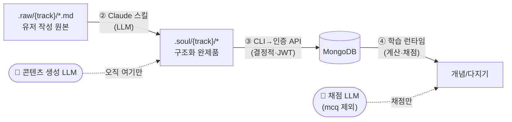

# 데이터 파이프라인: raw → soul → db → 학습

> 관련: [데이터 모델](./data-model.md) · [알고리즘 상세](./learning-algorithm-detail.md) · [개요](./learning-algorithm-overview.md)

## 대원칙 — **콘텐츠 생성 LLM은 2단계에서만**

```
.raw/{track}  ──[① 유저 유지]
      │
      ▼  ② .claude 스킬 (콘텐츠 생성 LLM 유일 지점)
.soul/{track}/* (완제품 구조화 데이터)
      │
      ▼  ③ import: CLI → 인증 API(JWT→userId) (순수 결정적, LLM 없음)
   MongoDB
      │
      ▼  ④ 학습 런타임 (순수 계산 + 채점) — 채점은 경량 LLM, mcq만 동등비교
```

→ **콘텐츠 생성은 ②에서만.** ②가 "런타임에 필요한 모든 것"(문항·정답·오답·해설)을 완제품으로 산출한다. 이 문서의 부합성 체크(§6)는 "런타임이 요구하는 모든 데이터가 ②에서 베이크되는가"를 검증한다.

> **런타임 채점(LLM 통합):** ④의 **채점**은 경량 LLM(Gemini 3.1 Flash-Lite)에 **일괄 위임**한다 — `{score, reason}` 반환, `reason`은 학습자에게 노출, `score`로 SRS 등급. 유일한 예외는 `mcq`(클릭 선택 → 동등비교, LLM 없음). 핵심 경계는 유지된다: **런타임 LLM은 콘텐츠를 만들지 않고, ②가 베이크한 정답·해설을 기준으로 *채점*만 한다.** 자세한 계약·폴백·매핑은 [runtime-grading.md](./runtime-grading.md).



---

## 1단계 — `.raw/{trackName}/` (유저가 직접 유지)

- 자유 형식 md. 여러 소스 가능 → 한 트랙에 여러 파일.
  ```
  .raw/토익/part5_문법.md
  .raw/토익/vocab_band7.md
  .raw/물리/역학.md
  ```
- `.gitignore`에 `.raw/*` 이미 등록(원본은 커밋 안 함, 유저 로컬 유지).
- 트랙 식별 = **디렉토리명 `{trackName}`**.

---

## 2단계 — `.claude` 스킬로 `.soul/{trackName}/` 가공 (LLM 유일)

- **스킬 위치(예정):** `.claude/skills/soul-structuring/SKILL.md` — `plugin-dev:skill-creator` 가이드로 제작.
- **입력:** `.raw/{trackName}/*.md`
- **출력:** `.soul/{trackName}/` — **DB 콘텐츠 스키마와 1:1(유저 진도 제외)**.
- **스킬이 반드시 완성해야 하는 "완제품" 항목** (런타임 채점의 기준):
  - concept: `title, bodyMd, elaboration, order, confusableWith`
  - card: `type, prompt, **answer**(참조정답), distractors(mcq), hint, **explanation**, difficultyPrior`
  - `grading`(선택) — LLM 장애 시 결정적 폴백용 `acceptedAnswers`/`keywords`/`rubric`. 필수 아님(§6).

### `.soul` 디렉토리/파일 스키마
```
.soul/토익/
  manifest.json          # 트랙 메타(시험일 제외 — 시험일은 유저 입력)
  decks/
    part5_문법.json       # deck + concepts + cards 임베드
    vocab_band7.json
```

`manifest.json`
```jsonc
{
  "soulVersion": 1,
  "trackSlug": "토익",
  "title": "토익",
  "subjectType": "language",
  "decks": [
    { "slug": "part5_문법", "title": "Part 5 · 문법", "order": 1, "sourceRef": ".raw/토익/part5_문법.md" },
    { "slug": "vocab_band7", "title": "Vocab Band 7", "order": 2, "sourceRef": ".raw/토익/vocab_band7.md" }
  ]
}
```

`decks/part5_문법.json`
```jsonc
{
  "deckSlug": "part5_문법",
  "concepts": [
    {
      "conceptKey": "present-perfect-vs-past",   // ② 산출 안정 키(idempotent import용)
      "title": "현재완료 vs 과거시제",
      "bodyMd": "## 핵심\n현재완료는 …",
      "elaboration": "왜? 과거 한 시점 vs 현재 영향…",
      "order": 3,
      "confusableWith": ["past-perfect-vs-past"], // conceptKey 참조
      "cards": [
        {
          "cardKey": "pp-since-2010",             // ② 산출 안정 키
          "type": "cloze",
          "prompt": "He ___ (live) here since 2010.",
          "answer": "has lived",
          "distractors": [],
          "hint": "since + 완료",
          "explanation": "since + 기간 → 현재완료. 과거(lived)는 현재와 단절.",
          "difficultyPrior": 0.3,
          "grading": { "acceptedAnswers": ["has lived", "has lived here"], "normalize": ["lowercase","trim","collapse-space"] } // 선택: LLM 장애 폴백
        },
        {
          "cardKey": "pp-vs-past-usage",
          "type": "application",
          "prompt": "다음 상황에 맞는 시제를 쓰고 이유를 설명: 'I ___ him three times this week.'",
          "answer": "have met — this week(현재 포함 기간)이므로 현재완료",
          "distractors": [],
          "hint": "this week가 끝났나?",
          "explanation": "this week는 아직 진행 중인 기간 → 현재완료.",
          "difficultyPrior": 0.6,
          "grading": { "rubric": ["현재완료 사용", "기간이 현재 포함임을 언급"] } // 선택: LLM 채점 일관성↑
        }
      ]
    }
  ]
}
```

> **핵심:** 런타임 채점은 `card.type`이 결정한다 →
> - `mcq`: 보기 **동등비교**(LLM 없음, 즉시·무료)
> - `cloze`·`qa`·`application`: 경량 LLM(Gemini Flash-Lite)이 `answer`·`explanation` 기준으로 **`{score, reason}` 채점**, `reason`은 학습자에게 노출 — [runtime-grading.md](./runtime-grading.md) 참조.
> `grading` 객체는 ②에서 베이크하되 **선택**이다(LLM 장애 시 결정적 폴백용 `acceptedAnswers`/`keywords`/`rubric`).

> **⚠️ 자가채점(self) 폴백의 대가 (의식적 결정).** LLM·mcq 동등비교 모두 불가한 최후 상황에서만 "정답·해설 공개 후 자가채점"으로 강등된다. 자가채점은 "사용자의 '안다'를 믿지 말라"는 원칙을 일부 되돌려 관대 편향 → S 과대평가 → 복습 부족 위험이 있다. 제약:
> 1. **자가채점은 폴백 전용** — LLM이 살아 있으면 개방형도 LLM이 `{score,reason}`으로 채점한다. self는 LLM 장애 + 결정적 폴백(keywords/acceptedAnswers)도 없을 때만.
> 2. **자가채점 단독 성공만으로는 `maintaining` 승급 금지** — LLM 또는 mcq 동등비교 성공이 섞여야 하며, 아니면 더 보수적 S 증가를 적용(`selfOnlySuccess`, [data-model.md](./data-model.md) 졸업 규칙).

---

## 3단계 — import (`.soul` → **인증 API** → DB)

- **순수 결정적. LLM 없음.** CLI 스크립트가 `.soul/{track}/**`를 읽어 **인증된 API `POST /tracks/import`에 JSON으로 POST**(사용자 JWT 동봉)한다. API가 그 본문을 컬렉션에 upsert. (Mongo 직접 쓰기 아님 — 소유권을 JWT에서 도출하기 위함, [auth.md](./auth.md))
- 매핑:
  - `manifest` → `tracks` (단 **`examDate`는 유저 입력**으로 받음: CLI 인자 또는 앱 트랙 생성 폼)
  - `decks[]` → `decks`
  - `concepts[]` → `concepts` (`confusableWith`의 conceptKey → ObjectId 해소)
  - `cards[]` → `cards`
  - **각 card마다 `cardStates` 초기화 생성**: `{ stage:"new", S:0, D:difficultyPrior, dueAt: now, reps:0 }`
- **Idempotent:** `conceptKey/cardKey`를 안정 외부키로 저장(`cards.soulKey`) → 재가공 시 콘텐츠 갱신, **진도(cardStates) 보존**.
- 재가공으로 prompt/answer가 바뀐 카드는 `soulHash` 비교로 감지 → 정책에 따라 진도 유지 또는 리셋(§7).
- **★ Orphan(삭제) 정책 — 필수:** 재가공 시 LLM이 이전에 있던 카드를 **더는 안 만들 수 있다.** upsert만 하면 그 카드가 DB에 남아 `dueAt≤now` 스케줄러에 계속 잡히는 **좀비 카드**가 된다. → import는 `{userId,trackId}` 범위의 **기존 soulKey 집합과 새 `.soul`의 soulKey 집합을 diff**해, 빠진 카드를 **soft-delete(`status:"archived"`)** 하고 스케줄러 쿼리에서 제외(`status:"active"` 조건 추가). 해당 cardStates도 함께 비활성.
- **★ 유저 네임스페이스:** `.raw/.soul`은 `{trackName}`만으로 키잉되어 **유저 구분이 없다.** `trackSlug:"토익"`은 유저 간 충돌하므로 **API가 JWT에서 `userId`를 도출해 주입**하고, `trackSlug/soulKey` 유일성은 항상 `{userId, …}`로 스코프. 이제 **여러 구글 계정이 한 인스턴스에서 독립**(단일유저 전제 폐기). CLI는 `.soul`을 읽어 사용자 토큰으로 import API를 호출하는 얇은 클라이언트일 뿐 — 별도 "유저 매핑 단계"는 JWT가 대신한다.

---

## 4단계 — 학습 런타임 (LLM 2용도: 채점 · 이해도 게이트)

- **다지기 채점:** `card.type`이 결정 — `mcq`는 동등비교(LLM 없음), 그 외는 **경량 Gemini가 `{score, reason}` 채점**(`reason` 노출, `score`→등급). LLM 장애 시 폴백. [runtime-grading.md](./runtime-grading.md).
- **응답 지연:** 모든 비-mcq 카드가 LLM 지연을 짊어지므로 **선접수-후채점(accept-then-grade) 필수** — 즉시 다음 카드로 넘기고 결과 도착 시 비동기로 S·dueAt 패치.
- **스케줄/우선순위/건강/트리아지/간격:** 전부 순수 계산([데이터 모델 §5](./data-model.md)).
- **개념 모드(이해도 게이트):** `bodyMd/elaboration/explanation` 표시 + 자가설명 입력 → **경량 LLM이 이해 충분 여부 판정({understood, feedback})**. 충분하면 통과, 부족하면 형성 피드백+재설명. **채점 아님·S 미반영·저장 안 함**(휘발성). 첫 노출에만 게이트, relearning/크램은 스킵. [runtime-grading.md](./runtime-grading.md#개념-이해도-게이트-자가설명-확인).
- **사전테스트:** 추측 입력 → `answer/explanation` 공개. (LLM 호출 안 함 — S 미반영)

---

## 5단계 외 — `.soul` 버전관리

- `.soul/*`는 **생성 산출물** → `.gitignore` 권장(원본 `.raw`만 유저 유지, DB가 진실원천).
- 단, 재현·디버깅을 위해 커밋하고 싶으면 트랙별 선택 커밋도 가능(결정 §7).

---

## 6. 부합성 체크 — 콘텐츠는 ②에서만 생성되는가 (런타임 LLM은 채점·이해도 확인만, 생성 아님)

| 런타임이 필요로 하는 것 | 어디서 충족 | 콘텐츠 생성? | 비고 |
|---|---|---|---|
| 개념 본문/근거 | ② `bodyMd/elaboration` | ❌ | 표시만 |
| 인출 문항(prompt/answer) | ② `cards` | ❌ | |
| mcq 오답(distractors) | ② 베이크 | ❌ | 런타임 생성 금지 |
| 혼동쌍(교차·변별 출제) | ② `confusableWith` | ❌ | |
| 해설/힌트 | ② `explanation/hint` | ❌ | |
| **답안 채점(`{score,reason}`)** | ④ 런타임 — `mcq`=동등비교, 그 외=경량 LLM | 🟡 채점만 | 콘텐츠를 만들지 않고 ②의 정답·해설을 *적용*. LLM 장애 시 결정적 폴백([runtime-grading.md](./runtime-grading.md)) |
| **개념 이해도 게이트(`{understood,feedback}`)** | ④ 런타임 — 경량 LLM | 🟡 판정만 | ②의 `elaboration`을 기준으로 자가설명 *판정*. S 무관·저장 안 함·LLM 장애 시 공개 후 통과([runtime-grading.md](./runtime-grading.md#개념-이해도-게이트-자가설명-확인)) |
| 초기 난이도 시드 | ② `difficultyPrior` → cardState.D | ❌ | |
| 스케줄(dueAt)·간격·우선순위 | ④ 순수 계산 | ❌ | |
| 건강상태·실현가능성·트리아지 | ④ 순수 계산 | ❌ | |
| 시험일(examDate) | **유저 입력**(③ 트랙 생성) | ❌ | ②/LLM 아님 |

**결론: 부합.** 콘텐츠 생성 LLM은 ②뿐이고, 런타임 LLM은 ②가 베이크한 정답·해설·근거를 기준으로 **채점·이해도 확인만** 한다. 성립 **전제 조건**:
1. **모든 card가 `answer`(참조정답)·`explanation`을 누락 없이 베이크** — LLM 채점·폴백·노출의 공통 기준. `validate_soul.py`가 강제.
2. **`mcq`는 `distractors[]` 필수**(선택지 렌더 + 동등비교).
3. `grading`(acceptedAnswers/keywords/rubric)은 **선택적 폴백** — 있으면 LLM 장애 시 결정적 강등, 없으면 자가채점 폴백.

---

## 7. 열린 결정 / 확정 사항

**확정(이번 검토 반영):**
- Orphan 삭제 → soft-delete(`status:"archived"`) + 스케줄러 제외. (§3)
- 유저 네임스페이스 → import는 **인증 API 경유**, `userId`는 JWT에서 도출. 멀티 구글 계정 독립(단일유저 전제 폐기). (§3·[auth.md](./auth.md))
- 채점 → **일괄 경량 LLM 위임**(`{score,reason}`), `mcq`만 동등비교. `grading`은 선택적 폴백. 자가채점 단독 성공은 숙달 승급 보류. (§2·[runtime-grading.md](./runtime-grading.md))

**남은 결정:**
- `.soul` gitignore 여부(생성물 vs 재현용 커밋).
- 재가공 시 `soulHash` 변경 카드의 cardStates 마이그레이션(진도 유지 vs 리셋).
- import 시 examDate 입력 경로(import API 인자 vs 앱 트랙 수정 폼 #3 — 후자가 기본).
- 스킬 출력 JSON 스키마 validate를 import 전단에 강제(미충족 시 import 실패).
