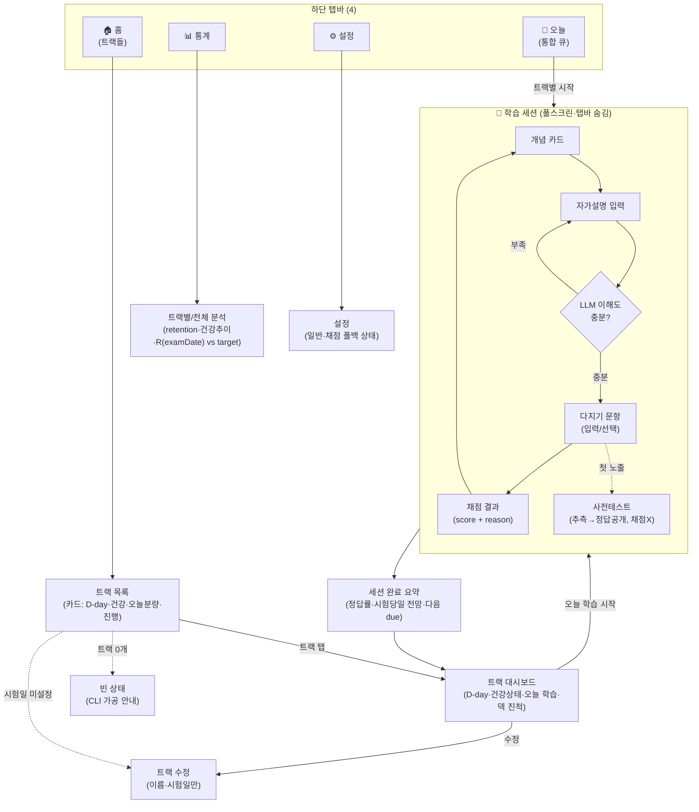

# 프론트엔드 화면구조도 (모바일 전용)

> 관련: [데이터 모델](./data-model.md) · [파이프라인](./data-pipeline.md) · [런타임 채점](./runtime-grading.md) · [알고리즘 개요](./learning-algorithm-overview.md)
>
> 스택: React + Tailwind (vitest). **모바일 전용** — 하단 4탭 + 단일 컬럼. 학습 세션만 탭바를 숨기는 풀스크린 몰입 모드.

## 대명제 — 프론트의 책임 경계

- **트랙 추가는 프론트에서 불가.** 콘텐츠는 오직 `soul-structuring` 스킬 → import 스크립트(CLI)로만 생성/추가된다([파이프라인 ②③](./data-pipeline.md)).
- **프론트가 쓰는 트랙 데이터는 "수정"만** — 그것도 **이름 + 시험일(deadline) 두 가지만**. `dailyCapacity`·삭제·아카이브는 프론트에서 다루지 않는다.
- import된 트랙은 **시험일이 비어 있을 수 있다**(examDate는 soul에 없고 유저 입력). 시험일 미설정 트랙은 학습 계획을 생성할 수 없으므로, **시험일 최초 지정도 "트랙 수정" 화면**에서 이뤄진다.
- 콘텐츠 생성 LLM은 ②에만, 채점 LLM은 런타임에. 프론트는 둘 다 만들지 않고 **표시·입력·세션 진행·결과 표시**만 한다.

## IA — 화면 지도



## 화면 인벤토리 (12 + 상태 변형)

| # | 화면 | 진입 | 핵심 역할 | 주 데이터 소스 |
|---|---|---|---|---|
| 1 | 트랙 목록(홈) | 탭 | 트랙 카드, D-day·건강 배지·오늘 분량·진행 | `tracks` + 집계(`cardStates`·`sessions`) |
| 2 | 트랙 대시보드 | 1→ | 한 트랙: 건강상태+설명, 오늘 학습(개념N/다지기M), 덱 진척, 시작 | `tracks`·`decks`·일일 플랜(런타임 계산) |
| 3 | 트랙 수정 | 1/2→ | **이름 + 시험일(deadline)만** 변경 | `tracks.title`·`tracks.examDate` |
| 4 | 학습 세션·개념(이해도 게이트) | 2/오늘→ | 본문/elaboration/혼동쌍 + 자가설명 → LLM 이해도 확인 후 통과(저장 안 함) | `concepts` + 런타임 LLM |
| 5 | 학습 세션·다지기 | 4→ | 문항 + 입력(텍스트)/선택(mcq) | `cards`·`cardStates` |
| 6 | 채점 결과 | 5→ | **score + reason**, 정답·해설, 등급, 자가보정 | 런타임 채점([runtime-grading](./runtime-grading.md)) |
| 7 | 사전테스트 | 5의 변형 | 첫 노출: 추측→정답·해설 공개(**채점 안 함·S 미반영**) | `cards`·`cardStates(wasPretest)` |
| 8 | 세션 완료 요약 | 세션끝 | 정답률, 갱신된 시험당일 전망, 다음 due | `sessions`·`reviewLogs`·런타임 예측 |
| 9 | 오늘(통합 큐) | 탭 | 전 트랙 due를 우선순위순, 트랙 배지 구분 | 전 트랙 `cardStates(dueAt≤now)` |
| 10 | 통계 | 탭 | retention 곡선·건강 추이·`R(examDate)` vs target | `reviewLogs`·`cardStates` 집계 |
| 11 | 설정 | 탭 | 일반·채점 LLM 폴백 상태(단일유저 전제) | 클라이언트 설정 |
| 12 | 빈 상태 | 1 변형 | 트랙 0개 → "CLI(skill+script)로 가공" 안내 | — |

## 화면별 와이어프레임

### 1. 트랙 목록 (홈)
트랙 독립성·긴급도를 카드로. **추가 버튼 없음**(CLI 전용). 시험일 미설정 트랙은 하단에 별도 구획.
```
┌─────────────────────────────┐
│ 내 학습                       │   ← + 버튼 없음
├─────────────────────────────┤
│ ┌─────────────────────────┐ │
│ │ 토익          🔴 D-1     │ │   ← 시험 임박=빨강
│ │ ⚠ 과부하 · 오늘 42문항    │ │   ← 건강상태 배지(알고리즘)
│ │ ▓▓▓▓▓▓░░░░ 60%           │ │   ← 오늘 진행
│ └─────────────────────────┘ │
│ ┌─────────────────────────┐ │
│ │ 오픽          🟡 D-12    │ │
│ │ ✓ 순항 · 오늘 18문항      │ │
│ │ ▓▓▓░░░░░░░ 30%           │ │
│ └─────────────────────────┘ │
│ ── 시험일 미설정 ──          │
│ ┌─────────────────────────┐ │
│ │ 물리   ⚠ 시험일 설정 필요 │ │   ← 탭 → 트랙 수정(#3)
│ │ 학습계획 생성 대기        │ │
│ └─────────────────────────┘ │
├─────────────────────────────┤
│  🏠     📅     📊     ⚙️      │   ← 탭바
└─────────────────────────────┘
```

### 2. 트랙 대시보드
한 트랙의 오늘. 건강상태 배너는 알고리즘 상태(ON-TRACK / BEHIND-과부하 / BEHIND-숙달 / AHEAD)에 따라 톤·문구·CTA가 달라진다.
```
┌─────────────────────────────┐
│ ‹ 토익                  수정 │   ← 수정 = 트랙 수정(#3)
├─────────────────────────────┤
│        D-1  ·  6월 11일       │   ← 시험일 카운트다운
│                              │
│  ⚠ 과부하 상태               │   ← 건강상태 + 설명
│  미룬 분량이 쌓였어요. 핵심   │
│  부터 좁혀서 진행합니다.      │
│  ┌──────────────────────┐   │
│  │ 오늘 트리아지 보기 ›  │   │   ← BEHIND-과부하일 때만 노출
│  └──────────────────────┘   │
├─────────────────────────────┤
│ 오늘의 학습                   │
│  개념 8 · 다지기 34   예상 25분│
│  ▓▓▓▓▓▓░░░░ 25/42            │
│                              │
│ 덱 진척                       │
│  1주차 시제      ▓▓▓▓▓▓▓░ 88% │
│  2주차 시제2     ▓▓▓░░░░░ 41% │
├─────────────────────────────┤
│   ▶  오늘 학습 시작 (계속)    │   ← 1차 CTA
└─────────────────────────────┘
```

### 3. 트랙 수정 (이름·시험일만)
```
┌─────────────────────────────┐
│ ‹ 토익 수정            [저장] │
├─────────────────────────────┤
│ 트랙 이름                     │
│ ┌─────────────────────────┐ │
│ │ 토익                    │ │
│ └─────────────────────────┘ │
│                              │
│ 시험일 (deadline)             │
│ ┌─────────────────────────┐ │
│ │ 2026-06-11          📅  │ │
│ └─────────────────────────┘ │
│                              │
│ ⓘ 이름·시험일만 수정 가능.    │
│   트랙 추가/삭제는 CLI(스킬   │
│   +스크립트)에서만 합니다.    │
└─────────────────────────────┘
```

### 4. 개념 (이해도 게이트)
개념 노출 → 자가설명 입력 → LLM이 이해 충분 여부 판정. 충분하면 다지기로 통과, 부족하면 형성 피드백+재설명. **자가설명은 저장 안 함, S 미반영.** 2회 부족 시 모범 설명 공개 + "넘어가기", LLM 지연/실패 시도 같은 폴백.
```
개념 노출                  자가설명 → 확인
┌───────────────────────┐  ┌───────────────────────┐
│ ✕              개념 3/8 │  │ ✕              개념 3/8 │
│ 현재완료 vs 과거         │  │ 내 말로 설명 (왜?)      │
│                        │  │ ┌───────────────────┐  │
│ 핵심: 현재완료는 과거의 │  │ │ 과거는 지금이랑 끊긴│  │
│ 일이 지금까지 영향…     │  │ │ 거고 현재완료는...  │  │
│                        │  │ └───────────────────┘  │
│ ⚠ 혼동: 과거 / 과거완료 │  │        [확인]           │
│                        │  ├────────────────────────┤
│ ┌───────────────────┐  │  │ ✓ 충분 — "지속/영향을  │  ← {understood,feedback}
│ │ 내 말로 설명하기 › │  │  │   잘 짚었어요"          │
│ └───────────────────┘  │  │        [다지기 ›]       │  ← 통과
└───────────────────────┘  │ (부족이면: 빠진 핵심    │
                            │  피드백 + 재설명, 2회 후 │
                            │  모범설명+"넘어가기")   │
                            └───────────────────────┘
* 확인 중…(Flash-Lite) · 실패 시 elaboration 공개 후 통과

### 5–6. 다지기 → 채점 결과
세션은 풀스크린(탭바 숨김). 상단에 진행 바 + 종료(✕). 채점은 **선접수-후채점**: 제출 즉시 다음으로 넘기고 결과 도착 시 비동기로 카드 상태·피드백 패치.
```
다지기(입력형)            채점 결과
┌───────────────────────┐  ┌───────────────────────┐
│ ✕         ▓▓▓▓░░ 24/42 │  │ ✕         ▓▓▓▓░░ 25/42 │
│ 토익 · 현재완료         │  │                        │
│                        │  │   ◓ 0.7  부분정답       │  ← score + 등급
│ He ___ (live) here     │  │                        │
│ since 2010.            │  │ "시제는 맞았으나 since  │  ← reason(LLM 생성)
│                        │  │  뒤 기간 해석이 빠졌어요"│
│ ┌───────────────────┐  │  │                        │
│ │ has lived         │  │  │ 정답: has lived         │
│ └───────────────────┘  │  │ 해설: since+기간 → 현재 │
│           [제출]        │  │  완료. 과거형은 단절.   │
│                        │  │ ┌────┬────┬────┬─────┐ │
│ 💡 힌트 보기            │  │ │다시│어려│좋음│쉬움 │ │  ← 자가 등급 보정(선택)
└───────────────────────┘  │ └────┴────┴────┴─────┘ │
* mcq면 입력칸 대신 보기버튼  │        [다음 ›]         │
  (동등비교·즉시 채점)        └───────────────────────┘
                            * 지연 시 "채점 중…" → 도착 시 패치
```

### 7. 사전테스트 (첫 노출, 채점 안 함)
```
┌───────────────────────┐
│ ✕              새 개념  │
│ 먼저 추측해보세요       │
│ (틀려도 괜찮아요)       │
│                        │
│ 미래완료의 형태는?      │
│ ┌───────────────────┐  │
│ │ ____              │  │
│ └───────────────────┘  │
│      [확인하기]         │
│                        │
│ → 추측 후 정답·해설만   │   ← LLM 호출 안 함, S 미반영
│   공개(인코딩 시드)     │
└───────────────────────┘
```

### 8. 세션 완료 요약
```
┌───────────────────────┐
│         🎉 완료!        │
│                        │
│ 오늘 42문항 · 정답 81% │
│ 학습시간 23분           │
│                        │
│ 시험당일 예측           │   ← R(examDate) vs target
│  목표 90% → 현재 84% ↑ │
│ ▓▓▓▓▓▓▓▓░░             │
│                        │
│ 다음 복습: 오늘 21:00   │   ← 다음 dueAt
│ ┌──────────────────┐  │
│ │  대시보드로 ›     │  │
│ └──────────────────┘  │
└───────────────────────┘
```

### 9. 오늘 (통합 큐)
전 트랙 due를 우선순위순으로. 시험일이 다른 트랙을 한 큐에 섞지 않고 **트랙별 블록**으로 분리(독립성·긴급도 보존). 블록 안에서 트랙 세션 시작.
```
┌───────────────────────┐
│ 오늘 할 일              │
│ 전체 70문항 · 38분      │
├───────────────────────┤
│ 🔴 토익    42문항 D-1   │
│   ⚠ 과부하 · 우선       │
│   ┌─────────────────┐  │
│   │  토익 시작 ›     │  │
│   └─────────────────┘  │
│ 🟡 오픽    18문항 D-12  │
│   ┌─────────────────┐  │
│   │  오픽 시작 ›     │  │
│   └─────────────────┘  │
│ 🟢 물리    완료 ✓       │
├───────────────────────┤
│  🏠   📅   📊   ⚙️       │
└───────────────────────┘
```

### 12. 빈 상태 (트랙 0개)
```
┌───────────────────────┐
│ 내 학습                │
├───────────────────────┤
│                        │
│   아직 트랙이 없어요    │
│                        │
│  콘텐츠는 CLI에서 가공  │
│  합니다:               │
│   1) soul-structuring  │
│      스킬로 .soul 생성  │
│   2) import 스크립트    │
│      로 DB 입력         │
│                        │
│  (추가는 프론트에서    │
│   불가)                │
└───────────────────────┘
```

## 건강상태 → 화면 표현 매핑

대시보드 배너·홈 배지·오늘 정렬이 알고리즘 건강상태([상세 §5.5](./learning-algorithm-detail.md))를 그대로 반영한다.

| 건강상태 | 배지/톤 | 대시보드 배너 | 추가 UI |
|---|---|---|---|
| ON-TRACK(순항) | 🟡 중립 | "순항 중. 오늘 분량을 진행하세요." | — |
| BEHIND-과부하 | 🔴 경고 | "미룬 분량이 쌓임. 핵심부터 좁힘." | **트리아지 보기**(범위 축소 제안) |
| BEHIND-숙달 | 🟠 주의 | "정답률이 목표 미달. 복습을 늘립니다." | 난이도/반복 ↑ 안내 |
| AHEAD(여유) | 🟢 양호 | "여유 있음. 미리 더 할 수 있어요." | 선행 학습 제안(선택) |
| 시험일 미설정 | ⚪ 비활성 | "시험일을 설정해야 계획이 생성됩니다." | **트랙 수정으로 이동** |
| 실현 불가 | 🔴 강경고 | "남은 기간으로는 전 범위가 어려움." | 우선순위 트리아지 강제 제안 |

## 상태 변형 카탈로그 (구현 시 반드시 처리)

- **LLM 채점 지연:** 선접수-후채점. 제출 → 즉시 다음 카드. 결과 도착 시 그 카드에 `score/reason` 패치(완료 요약 전에 반영). 지연 표시는 "채점 중…" 미니 인디케이터.
- **LLM 채점 실패(폴백):** 결정적 폴백(키워드/정답대조) 또는 "정답·해설 공개 후 자가채점" 화면으로 강등. `graderMode`를 내부 기록(통계에 노출 안 함).
- **트리아지(BEHIND-과부하):** "오늘 트리아지 보기" → 시험 가중치 낮은 개념/덱을 오늘 범위에서 제외하는 제안 리스트(토글).
- **오늘 분량 완료:** 대시보드 CTA가 "추가 복습(선택)"으로 전환, 홈 카드 진행률 100%·🟢.
- **세션 중 이탈/복귀:** 세션은 서버 상태가 진실원천(무동결 플랜) — 복귀 시 다시 계산된 due로 이어서.
- **사전테스트:** 신규 카드 첫 노출에서만. LLM 호출 없음, S 미반영, 정답·해설만 공개.

## 데이터 흐름 원칙

- **무동결 플랜:** 일일 학습 목록은 저장된 게 아니라 매 진입 시 `{userId, trackId}` 범위의 `cardStates`(dueAt·stage·archived 등)로 **런타임 재계산**([data-model §5](./data-model.md)). 미루기/몰아하기를 화면이 자동 흡수.
- **트랙 독립:** 모든 쿼리는 `{userId, trackId}`로 스코프. 홈/오늘의 트랙 블록은 서로 간섭하지 않음.
- **서버리스 정합:** 화면 진입 = 상태 조회 + 플랜 재계산(순수 계산). 채점 시에만 외부 LLM 1콜(mcq 제외).

## 오픈 결정 (구현 단계로 이월)

- 통계(#10)의 구체 지표·차트 종류 — retention 곡선/건강 추이/시험당일 예측 외 추가 여부.
- 다크모드/접근성(폰트 스케일·색맹 안전 배지) 적용 범위.
- 오프라인 캐시 / PWA 여부(모바일 전용이므로 검토 가치 있음).
