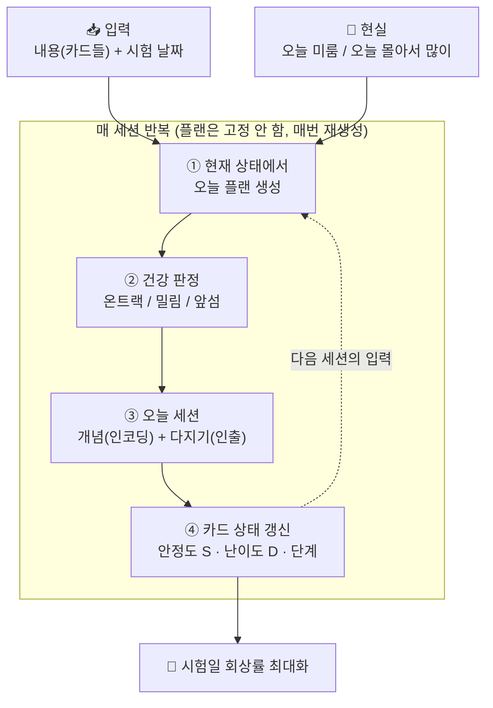
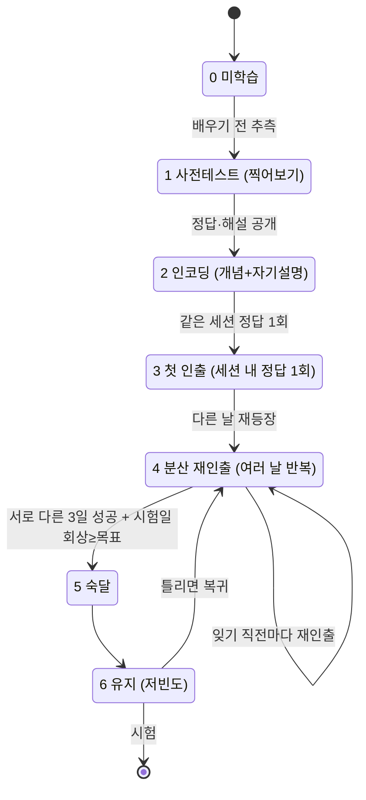
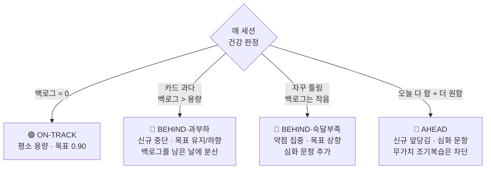
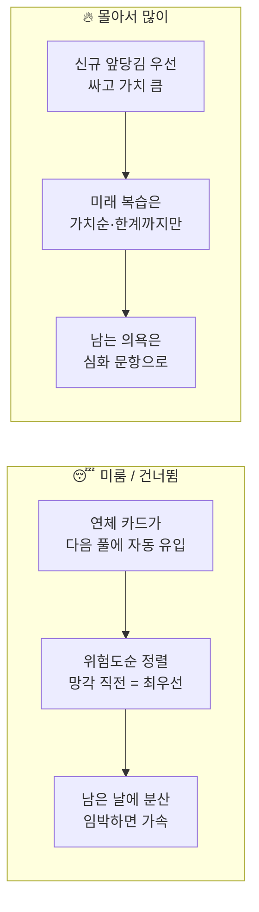

# 학습 알고리즘 개요 (ASR) — 한눈에

> 📄 모든 규칙·수치·근거는 **[상세 문서(learning-algorithm-detail.md)](./learning-algorithm-detail.md)**, 이론 근거는 **[리서치 문서](./learning-science-research.md)**.

**한 줄:** 입력은 **내용 + 시험 날짜**뿐. 거기서 **매일의 학습이 자동 생성**되고, 학습자가 **미루거나 몰아서 해도** 알고리즘이 학습량·강도를 **유동적으로 재조정**한다.

엔진 이름 **ASR (Adaptive Successive Relearning)** = 매 세션 **정답 1회까지 떠올리기**를 **여러 날에 분산**하고, 간격을 **시험일에 맞춰 조절**.

---

## 1. 무엇에 근거하나 — 효과 검증된 4대 원리

| 원리 | 한 줄 의미 | 출처 |
|---|---|---|
| **인출(Retrieval)** | 읽기 말고 **떠올리기**가 기억을 만든다 | 테스트 효과 (Dunlosky 최상위) |
| **분산(Spacing)** | 몰아서보다 **나눠야** 남는다 | Cepeda 메타분석 |
| **성공적 재학습** | **세션마다 한 번은 맞히고** 그 세션을 여러 날 반복 → 실제 시험 **1등급↑** | Rawson & Dunlosky |
| **사전테스트** | 배우기 전에 **먼저 틀려보면** 더 잘 외워진다 | Pretesting effect |

> 보조: 교차 출제(interleaving)로 헷갈리는 개념 변별, "왜?" 자기설명으로 인코딩 강화.
> 핵심 신념: **체감 난이도 ≠ 실제 효과**(Bjork). 사용자의 "안다"를 믿지 말고 **인출 데이터**로 판정.

---

## 2. 큰 그림 — 입력에서 매일 학습까지

핵심: **영속 상태는 `카드별 S·D·단계 + 시험일`뿐.** 매 세션 이 상태에서 새로 계산하므로, 미룸·몰아치기가 "밀린 플랜 복구" 로직 없이 자동 흡수된다.

---

## 3. 카드 한 장의 생애주기

- **복습 시점 = "잊기 직전"**: 인출확률 R이 목표 보유율(평소 0.90 → 시험 임박 0.95)로 떨어질 때.
- **간격은 안정도 S에서 자동 도출** — 성공할수록 S↑ → 간격이 자연히 벌어짐. 별도 ease 배수 없음.

---

## 4. 유동 조절의 심장 — 건강 상태 기계

매 세션 상태를 판정해 **학습량과 강도(목표 보유율·문항 난이도)**를 자동으로 돌린다.

> **왜 BEHIND가 둘인가 (가장 헷갈리는 지점):** "밀림"의 원인이 정반대 처방을 부른다.
> - **과부하**(카드가 너무 많아 밀림) → 목표를 올리면 복습이 더 늘어 **구멍이 깊어짐** → **목표 유지/하향 + 신규 중단**.
> - **숙달부족**(카드가 자꾸 새서 밀림) → 복습이 **모자란** 것 → **목표 상향 + 약점 집중**.

---

## 5. 두 가지 현실을 흡수하는 법

- **미룸:** 별도 복구 로직 없음 — 연체분이 다음 세션 풀에 섞여 위험도순으로 처리될 뿐.
- **몰아치기:** 무의미한 조기복습(아직 안 까먹은 카드 다시 보기)은 막고, 의욕을 **신규·심화**로 돌린다. 단 **시험 임박 압축 윈도에선** 목적이 "시험당일 회상 최대화"로 바뀌어 조기복습 차단을 **해제**.
- **분량 ≫ 남은 시간이면:** 조용히 누락하지 않고 **무엇을 포기하는지 사용자에게 드러내며(트리아지)** 일일 용량 상향을 권고.

---

## 6. 목적함수는 시기에 따라 뒤집힌다 (꼭 기억)

| 시기 | 목표 | 함의 |
|---|---|---|
| 평소 | 장기 보유를 **최소 복습**으로 | 간격 길게, 효율 우선 |
| **시험 임박** | **시험 당일** 회상률 **최대화** | 복습을 **더 늘림**(목표↑·간격 압축) — "복습 줄일수록 좋다"는 일반 SRS 프레임을 그대로 쓰면 틀림 |

---

## 7. 30초 요약

1. 입력은 **내용 + 시험 날짜**뿐 → 매일 플랜 자동 생성(고정 안 함).
2. 모든 노출은 **인출**, 같은 카드를 **여러 날 분산**, **세션마다 정답 1회**(성공적 재학습).
3. 첫 노출은 **찍기 → 개념 → 자기설명**. 복습은 **잊기 직전 + 즉시 피드백 + 교차 출제**.
4. 간격은 **안정도 S에서 자동**, **시험일로 cap**.
5. **미룸·몰아치기·분량초과**를 건강 상태기계(온트랙/과부하/숙달부족/앞섬)가 **유동 흡수**.
6. 시험 임박엔 목적이 **"시험당일 회상 최대화"**로 전환.
